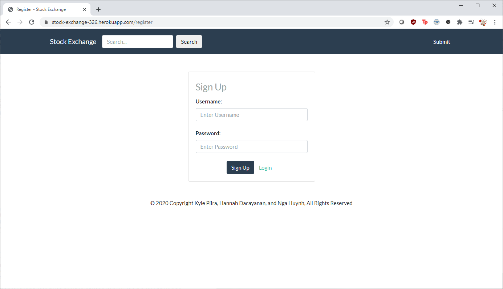

# Epsilon

## Stock Exchange

### Fall 2020

### Overview

Our application is a social news aggregation website for articles specifically related to the stock market and investments. Users can submit links to the site and tag them with a specific stock ticker. They can also leave comments on stories submitted by other users. Both links and comments can be voted on to determine popularity and ranking. Additionally, users can watch specific stocks by adding them to their Watchlist, allowing for them to get updates when people post new stories about them.

Each user has a reputation score on the site, which starts at $100. This score is used in several different features:

* Users have a fake stock portfolio on the site where they can buy and sell stocks. If their portfolio performs well based off of the returns of the actual stock market, it will increase their reputation score. If their portfolio returns poorly, their reputation score decreases.

* When users upvote submissions or comments, they transfer one of their reputation points to the author.

* When users downvote submissions or comments, 1 reputation point is taken from both the voter and the author.

* Users can upvote or downvote any number of times they want on a single submission or comment, so long as they have the reputation points to spend.

### Team Members, Github Aliases

* Kyle Piira, *[KylePiira]([KylePiira (Kyle Piira) · GitHub](https://github.com/KylePiira))*

* Hannah Dacayanan, *[hdacayanan]([hdacayanan · GitHub](https://github.com/hdacayanan))*

* Nga Huynh, *[Hannah_Huynh]([hannah1107 (Hannah_Huynh) · GitHub](https://github.com/hannah1107))*

### User Interface

#### Homepage

The homepage of the website, allows the user to see recent news about the stocks on their Watchlist. If the Watchlist is empty, it displays the top stories from the entire website.

The user's watchlist is displayed on the left sidebar, and the user's portfolio and reputation are displayed on the right sidebar; both sidebars are typically visible on most pages of the site.

Users can also upvote and downvote stories.


#### Stock

Displays the trending stories for a specific stock ticker. It allows the user to buy or sell the stock, and potentially add it to their Watchlist.

Users can also upvote and downvote stories.


#### Search Results

When the user enters a search query into the navbar (which is visible on every page of the site), they will be brought to the search results page, which contains a list of stories that match their query.

Users can also upvote and downvote stories.


#### Story

The page that displays all of the comments on a story, and allows users to add new comments or reply to already existing comments.

Users can also upvote and downvote the current story, as well as vote on comments.


#### User Profile

The submissions tab allows for users to see a reverse-chronological list of a specific user's submissions.

Users can also upvote and downvote submissions from this page.


The comments tab allows for users to see a reverse-chronological list of a specific user's comments.

Users can also upvote and downvote comments from this page.


The portfolio tab displays a list of the stocks a user has bought or sold.


#### Submit

A user can enter a title, URL, and stock ticker to submit a new story.


#### Login

The page that allows users to login.


#### Sign Up

The page that allows users to make a new account.



#### Admin

A user can be an admin, which allows them access to exclusive admin pages.

The users tab allows the admin to create, read, update, and delete users.


The submissions tab allows the admin to create, read, update, and delete submissions.


### API

#### User API

`GET /api/userId`

retrieves a userId of the currently logged-in user

`GET /api/user/:userId`

retrieves a user by its userId

`POST /api/user`

creates a user

`POST /api/user/edit`

edit a user

`DELETE /api/user/userId`

deletes a user

`GET /api/user/:userId/comments`

retrieves comments by userId

`GET /api/user/:userId/submissions`

retrieves submissions by a userId

`GET /api/user/:userId/watchlist`

retrieves watchlist by a userId

`POST /api/user/:userId/watchlist`

adds an investment to watchlist

`DELETE /api/user/:userId/watchlist`

deletes an investment from watchlist

`GET /api/user/:userId/long`

retrieves a list of stocks of user's long

`POST /api/user/:userId/long`

buys a stock to a user's long

`GET /api/user/:userId/short`

retrieves a list of user's short

`POST /api/user/:userId/short`

sells a stock to user's short

`GET /api/user/:userId/reputation`

gets a user's voting power level by a userId

#### Users API

`GET /api/users/all`

retrieves a list of all users

#### Story API

`GET /api/story/:storyId`

retrieve story by storyId

`POST /api/story/:storyId/upvote`

upvote story by storyId

`POST /api/story/:storyId/downvote`

downvote story by storyId

`DELETE /api/story/:storyId`

delete story by storyId

`POST /api/story/`

create a story

`POST /api/story/edit`

edit a story

`GET /api/story/:storyId/comments`

retrieve story comments by storyId

#### Stories API

`GET /api/stories/all`

retrieves all stories

`GET /api/stories/trending`

retrieves trending stories

`GET /api/stories/:investment`

retrieves stories by investment

#### Comment API

`GET  /api/comment/:commentId`

retrieves comment by commentId

`DELETE /api/comment/:commentId`

deletes comment by comment Id

`POST /api/comment/:commentId/upvote`

upvotes a comment by commentId

`POST /api/comment/:commentId/downvote`

downvotes a comment by commentId

`GET /api/comment/:commentId/comments`

retrieves a comment's comments by commentId

`POST /api/comment`

creates a comment

#### Search API

`GET /api/search`

retrieves search results

### Database

#### User Table

| Column     | Data Type | Description                                                                   |
| ---------- | --------- | ----------------------------------------------------------------------------- |
| id         | UUID      | The globally unique ID for a user                                             |
| username   | TEXT      | The globally unique username for a user                                       |
| password   | TEXT      | This field stores both the salt and hash of a user's password, like salt:hash |
| reputation | DOUBLE    | The user's reputation on the site                                             |
| created    | TIMESTAMP | When the user created their account                                           |
| is_admin   | BOOLEAN   | Whether the user is an admin                                                  |
| is_deleted | BOOLEAN   | Whether the user has been deleted                                             |

```sql
CREATE TABLE Users (
    id UUID PRIMARY KEY DEFAULT gen_random_uuid(),
    username TEXT UNIQUE,
    password TEXT,
    reputation DOUBLE PRECISION DEFAULT 100,
    created TIMESTAMP WITH TIME ZONE DEFAULT (NOW() AT TIME ZONE 'utc'),
    is_admin BOOLEAN DEFAULT FALSE,
    is_deleted BOOLEAN DEFAULT FALSE
);
```

#### Comments Table

| Column     | Data Type | Description                                                                          |
| ---------- | --------- | ------------------------------------------------------------------------------------ |
| id         | UUID      | The globally unique ID for a comment                                                 |
| author     | UUID      | The ID of the creator of the comment                                                 |
| parent     | UUID      | The ID of either the submission or a comment which the current comment is a reply to |
| body       | TEXT      | The content of the comment                                                           |
| created    | TIMESTAMP | When the comment was created                                                         |
| votes      | INTEGER   | The net amount of upvotes and downvotes                                              |
| replies    | INTEGER   | The number of direct child comments                                                  |
| is_deleted | BOOLEAN   | Whether the comment has been deleted                                                 |

```sql
CREATE TABLE Comments (
    id UUID PRIMARY KEY DEFAULT gen_random_uuid(),
    author UUID,
    parent UUID,
    body TEXT,
    created TIMESTAMP WITH TIME ZONE DEFAULT (NOW() AT TIME ZONE 'utc'),
    votes INTEGER DEFAULT 0,
    replies INTEGER DEFAULT 0,
    is_deleted BOOLEAN DEFAULT FALSE
);
```

#### Submissions Table

| Column     | Data Type | Description                                       |
| ---------- | --------- | ------------------------------------------------- |
| id         | UUID      | The globally unique ID for a submission           |
| author     | UUID      | The ID of the creator of the submission           |
| title      | TEXT      | The headline for the story                        |
| url        | TEXT      | The url to an external news article about a story |
| investment | TEXT      | The ticker symbol of an investment                |
| created    | TIMESTAMP | When the submission was created                   |
| votes      | INTEGER   | The net amount of upvotes and downvotes           |
| replies    | INTEGER   | The number of direct child comments               |
| is_deleted | BOOLEAN   | Whether the submission has been deleted           |

```sql
CREATE TABLE Submissions (
    id UUID PRIMARY KEY DEFAULT gen_random_uuid(),
    author UUID,
    title TEXT,
    url TEXT,
    investment TEXT,
    created TIMESTAMP WITH TIME ZONE DEFAULT (NOW() AT TIME ZONE 'utc'),
    votes INTEGER DEFAULT 0,
    replies INTEGER DEFAULT 0,
    is_deleted BOOLEAN DEFAULT FALSE
);
```

#### User Investments Table

| Column     | Data Type | Description                                    |
| ---------- | --------- | ---------------------------------------------- |
| author     | UUID      | The user who is associated with the investment |
| investment | TEXT      | The ticker symbol of an investment             |
| type       | TEXT      | One of watchlist, long, or short               |

```sql
CREATE TABLE UserInvestments (
    author UUID,
    investment TEXT,
    type TEXT
);
```

### URL Routes/Mappings

`GET /`

gets the home page, only logged-in users can access

`GET /story`

gets a story page, only logged-in users can access

`GET /investment`

gets an stock/investment page, only logged-in users can access

`GET /user`

gets a user's profile page, only logged-in users can access

`GET /login`

gets the login page, accessible to everyone if not already logged-in

`GET /register`

gets the sign up page, accessible to everyone if not already logged-in

`GET /submit`

gets the submit submissions page, only logged-in users can access

`GET /search`

gets the search results page, only logged-in users can access

`GET /admin/submissions`

gets the admin submissions page, only admins can access

`GET /admin/users`

gets the admin users page, only admins can access

### Authentication/Authorization

We used the passport local module to simplify authentication. Users can sign up on the register page with a username and password, and they are redirected to the login page if the new user was successfully created. From the login page, they can log in with a username and password, and all pages besides the login and sign up page require the user to be logged in and authenticated. Thus, if the login was unsuccessful, then the user stays on the login page.

Some users have a special admin permission, which grants them access to the admin area. By default, new users are not admins, and only existing admins can grant admin permissions to other users.

### Division of Labor

#### Kyle Piira

* <u>Milestone 1</u>
  
  * Homepage
  
  * Stock page
  
  * Story page
  
  * User profile

* <u>Milestone 2</u>
  
  * Javascripts
    
    * database.js
    
    * investment.js (multiple people worked on this file)
    
    * listing.js
    
    * profile.js (multiple people worked on this file)
    
    * search.js
    
    * story.js
    
    * submit.js
  
  * Routes
    
    * api.js (multiple people worked on this file)
    
    * index.js (multiple people worked on this file)
  
  * Views
    
    * index.html (multiple people worked on this file)
    
    * stock.html (multiple people worked on this file)
    
    * story.html (multiple people worked on this file)
    
    * submit.html (multiple people worked on this file)
    
    * wrapper.html (multiple people worked on this file)

* <u>Milestone 3</u>
  
  * Database
    
    * User Investments
    
    * Search
  
  * API
    
    * Story
    
    * Stories
    
    * Comment
    
    * Search
  
  * Public JS
    
    * listing.js
    
    * story.js
    
    * investment.js
    
    * comment.js (multiple people worked on this file)
    
    * submission.js (multiple people worked on this file)
    
    * submit.js (multiple people worked on this file)
    
    * profile.js (multiple people worked on this file)
    
    * Python template

#### Hannah Dacayanan

* <u>Milestone 1</u>
  
  * Search Results
  
  * Submit
  
  * Login
  
  * Sign up

* <u>Milestone 2</u>
  
  * Javascripts
    
    * sidebars.js
    
    * invesment.js (multiple people worked on this file)
    
    * login.js
    
    * profile.js (multiple people worked on this file)
  
  * Routes
    
    * api.js (multiple people worked on this file)
    
    * index.js (multiple people worked on this file)
  
  * Views
    
    * index.html (multiple people worked on this file)
    
    * login.html (multiple people worked on this file)
    
    * search-results.html (multiple people worked on this file)
    
    * sign-up.html (multiple people worked on this file)
    
    * stock.html (multiple people worked on this file)
    
    * story.html (multiple people worked on this file)

* <u>Milestone 3</u>
  
  * Database
    
    * Submission
    
    * Comments
  
  * API
    
    * User
    
    * Users
  
  * Authentication
    
    * Passport
    
    * Passport local
  
  * Deleting Comments
  
  * Removed Nunjucks

#### Hannah Huynh

* <u>Milestone 1</u>
  
  * Admin area
    
    * User management
    
    * Submission management

* <u>Milestone 2</u>
  
  * Javascripts
    
    * admin-submissions.js
    
    * admin-users.js
    
    * comment.js
    
    * submission.js
    
    * profile.js (multiple people worked on this file)
    
    * index.js
  
  * Views
    
    * admin/submissions.html
    
    * admin/users.html
    
    * comment.html
    
    * profile.html
    
    * login.html (multiple people worked on this file)
    
    * search-results.html (multiple people worked on this file)
    
    * wrapper.html (multiple people worked on this file)
    
    * sign-up.html (multiple people worked on this file)
    
    * stock.html (multiple people worked on this file)
    
    * submit.html (multiple people worked on this file)

* <u>Milestone 3</u>
  
  * Admin
    
    * User
    
    * Submissions
  
  * Database
    
    * User
  
  * Public JS
    
    * profile.js (multiple people worked on this file)
    
    * sidebars.js
    
    * comment.js (multiple people worked on this file)
    
    * submission.js (multiple people worked on this file)
    
    * submit.js (multiple people worked on this file)
    
    * admin-submissions.js
    
    * admin-users.js
  
  * Server-side
    
    * gui.js
    
    * miniCrypt.js

### Conclusion

We learned a tremendous amount about using the Bootstrap CSS framework to build functional UIs. We also learned how useful it can be to plan out what code you're going to write beforehand, which was different from what most of us were used to, in which we would just start writing code-- it was easier to fill in the gaps.

Surprisingly (or unsurprisingly), it was very difficult to center elements without the infamous center tag. Writing the views in Javascript also proved to be a challenge.

We also wish we had more prior experience with Git before diving into this project. While we used it in class before, it was not to the same extent that was required for the group project, which made merging from development branches to the master branch occasionally very difficult.

All in all, we learned a great deal about web programming, the development process, and working with external APIs.


